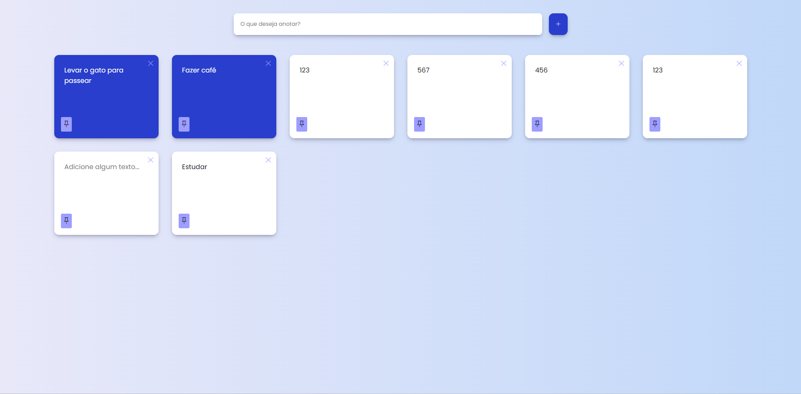

# 📚 **Sistema de Gerenciamento de Notas**

Este projeto é uma aplicação full-stack para gerenciar notas. O sistema inclui uma interface front-end desenvolvida com **HTML**, **CSS** e **JavaScript**, além de um back-end robusto utilizando **Node.js** e **Express**, com persistência de dados gerenciada pelo **Sequelize**.

---

## 🚀 **Funcionalidades**

### **Front-End**
- Adicionar, atualizar, excluir e fixar notas.
- Salvamento automático das notas com debounce para reduzir chamadas redundantes à API.
- Atualizações em tempo real na ordem das notas fixadas.
- Notificações toast e spinner de carregamento para uma melhor experiência do usuário.

### **Back-End**
- API REST para gerenciamento de notas.
- Interações com o banco de dados através do ORM Sequelize.
- Arquitetura segura e escalável com Express.

---

## 🛠️ **Tecnologias Utilizadas**

- **HTML5**: Estruturação do conteúdo.
- **CSS3**: Estilo e responsividade.
- **JavaScript**: Lógica de interação no front-end.
- **Node.js**: Desenvolvimento do back-end.
- **Express**: Framework para criação da API REST.
- **Sequelize**: ORM para interação com o banco de dados.

---

## 🔧 **Como o Sistema Funciona**

1. **Adicionar Notas**: Os usuários podem digitar no campo de entrada para criar e salvar novas notas no servidor.  
2. **Editar Notas**: As alterações feitas nas notas são salvas automaticamente após um pequeno intervalo.  
3. **Fixar Notas**: Notas podem ser fixadas no topo da lista.  
4. **Excluir Notas**: Notas podem ser apagadas com um clique.  
5. **Persistência de Dados**: Todas as notas são armazenadas em um banco de dados gerenciado pelo Sequelize.  

---

## 📋 **Requisitos**

### **Front-End**
- Navegador web moderno.

### **Back-End**
- Node.js (v14 ou superior).  
- Servidor de banco de dados compatível com Sequelize (ex.: PostgreSQL, MySQL, SQLite).  

---

## 🔧 **Como Configurar o Projeto**



1. Clone este repositório:
   ```bash
   git clone https://github.com/Vinicius-Rodriguess/Task-Board.git
   cd Note-Management-System
   ```

2. Instale as dependências:
   ```bash
   npm install
   ```

3. Configure a conexão com o banco de dados no arquivo de configuração do Sequelize.

4. Inicie o servidor:
   ```bash
   node server.js
   ```

5. Abra o front-end no navegador e comece a interagir com o sistema.

---

## 🖥️ **Exemplo de Uso**

1. **Adicionar notas**: Digite no campo apropriado e clique em "Salvar".  
2. **Editar notas**: Faça alterações diretamente nas notas, que serão salvas automaticamente.  
3. **Fixar notas**: Fixe uma nota para que ela seja exibida no topo da lista.  
4. **Excluir notas**: Clique no ícone de exclusão para apagar uma nota.  

---

## 📌 **Limitações**

- Requer configuração e execução de um banco de dados.  
- O back-end deve estar em execução para que todas as funcionalidades funcionem.  

---

## ✅ **Melhorias Futuras**

- Adicionar autenticação de usuários.  
- Melhorar a interface para uma organização mais eficiente das notas.  
- Implementar um banco de dados baseado na nuvem para facilitar demonstrações.  

---

## 👨‍💻 **Autor**

**Vinicius Rodrigues**

- GitHub: [Vinicius-Rodriguess](https://github.com/Vinicius-Rodriguess)  
- Email: rodrigues.vini.2004@gmail.com  
